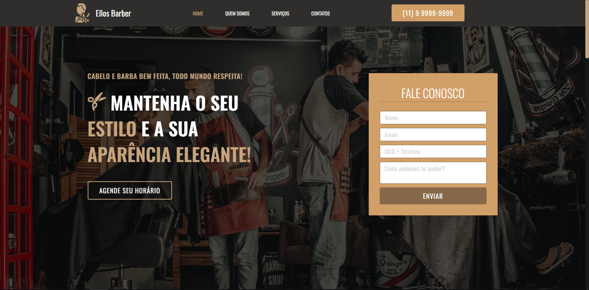

<h1 align="center"> 👾 #EllosDesign | Teste Front-End | Ellos Barber 👾 </h1>

    <i> "Ellos Barber - Cabelo e barba bem feita, todo mundo respeita" </i> 
      Este é o resultado do meu Teste Front-End da <a href="https://www.ellosdesign.com.br/"> Ellos Design.</a>

## 🚀 Tecnologias

Esse projeto foi desenvolvido com as seguintes tecnologias:

- HTML5
- CSS3
- Animações CSS
- Javascript
- Github

## 💻 Projeto

Este site tem como objetivo mostrar ao cliente e agendar um horário na barbearia Ellos Barber.  

Projeto construído a partir da documentação proposta pela [Ellos Design](https://github.com/brenobotelho/teste-frontend-developer).  

📌 Utilizei o HTML para marcação do site, CSS para estilização e para animações desta landing page, a documentação como base da criação do projeto front-end e o Javascript para algumas funções do site.

Adaptei o site para responsivel, com facilidade em acesso por um mobile por via de Media Query, utilizei animações hover e scroll do CSS, efeito de fixação do header, transições ao entrar na página, etc. Hospedei o site no Git Pages para acesso de todos. [Entre e confira agora mesmo](https://brenobotelho.github.io/teste-frontend-developer/Site-Teste/).

## 📑 Deploy

Acesse o site Ellos Barber [clicando aqui](https://brenobotelho.github.io/teste-frontend-developer/Site-Teste/).

# 👤 Autor

**Breno Botelho**

👾 _Me siga nas redes sociais!_

- Github: [@brenobotelho](https://github.com/brenobotelho)
- Instagram: [@brenobotelho_](https://instagram.com/@brenobotelho_)
- Facebook: [Breno Botelho](https://facebook.com/BrenooBotelho)
- Linkedin: [Breno B.](https://br.linkedin.com/in/breno-botelho?trk=public_profile_browsemap)

